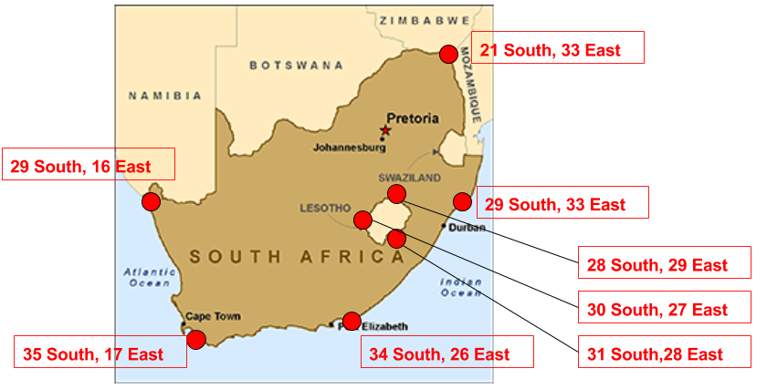
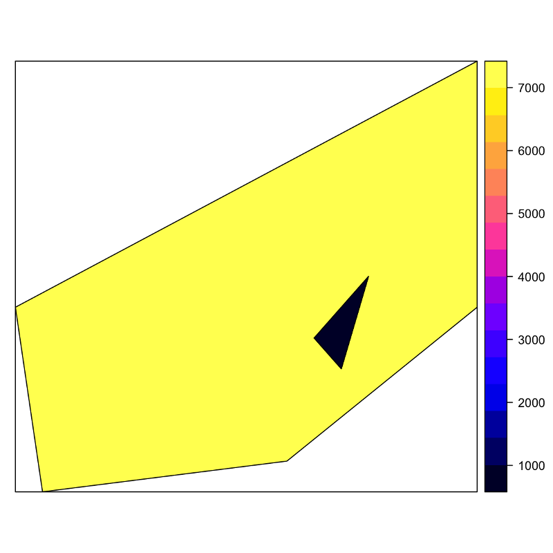

```{r setup, include=FALSE}
library(tufte)
library(xtable)

## libraries needed for R code examples
library(sp)
library(raster)
library(rgdal)

## knitr options
knitr::opts_chunk$set(echo = TRUE)
knitr::opts_knit$set(global.par = TRUE)

# See https://stackoverflow.com/questions/25646333/code-chunk-font-size-in-rmarkdown-with-knitr-and-latex
def.chunk.hook  <- knitr::knit_hooks$get("chunk")
knitr::knit_hooks$set(chunk = function(x, options) 
  {
  x <- def.chunk.hook(x, options)
  ifelse(options$size != "normalsize", paste0("\\", options$size,"\n\n", x, "\n\n\\normalsize"), x)
  })    
```

***

Benvenuto a _Dati Spaziali in R_! 
Questa prima serie di esercitazioni (in tre parti) è progettata per fornire un'introduzione 
ai due tipi di dati spaziali che incontrerete in R: dati vettoriali e dati raster. 
Alla fine di questo tutorial, dovresti avere una buona idea di come R rappresenta i dati spaziali 
e di come importare ed esportare i set di dati spaziali che potresti ottenere da altri programmi o fonti.

***

# 1 Dati spaziali in R: costruiamo oggetti partendo da zero!
Quasi tutte le strutture di dati vettoriali spaziali in R sono basate sul pacchetto `sp`. 
Anche altre librerie che possono sembrare indipendenti sono generalmente basate su `sp`, anche se non puoi vederlo.

Il pacchetto `sp` ha tre tipi principali di dati spaziali con i quali lavoreremo: punti, linee e poligoni.
Ci sono alcune differenze tra questi diversi tipi, ma sono tutti molto simili.

Per aiutarti a capire come sono queste strutture dati, in questa sezione creeremo alcuni dati spaziali da zero. 
Probabilmente questo non è il modo in cui lavorerai con i dati in futuro - il più delle volte importerai dati spaziali da una fonte - 
ma questo esercizio ti aiuterà a darti una buona base e ti aiuterà a sapere come risolvere i problemi futuri.

Esistono tre passaggi fondamentali per la creazione manuale di dati spaziali:

* **Creare oggetti geometrici (punti, linee o poligoni).**
* **Convertire gli oggetti geometrici in oggetti di tipo `Spatial*`.**^[`*` sta per `Points` (punti), `Lines` (linee) o `Polygons` (poligoni).]
    + Gli oggetti geometrici vivono in uno spazio astratto (il piano x-y). Per renderli oggetti *spaziali*, abbiamo bisogno di includere informazioni su come quelle coordinate x-y si riferiscono ai luoghi nel mondo reale usando un sistema di coordinate di riferimento (_Coordinate Reference System_ ovvero _CRS_).

* **(_Opzionale_:) Aggiungere un frame di dati o attributi, che trasformerà l'oggetto di tipo `Spatial*` in un oggetto di tipo `Spatial*DataFrame`.**

*** 

**Esercizio 0**

Cosa dobbiamo specificare per definire i dati vettoriali spaziali?

***

## 1.1 SpatialPoints: il tuo primo oggetto di tipo `Spatial*`!


I punti sono la forma geometrica più semplice, quindi iniziamo con la costruzione di un oggetto di tipo `SpatialPoints`.

## Crea i punti.
Un punto è definito da una coppia di coordinate x-y, quindi possiamo creare un insieme di punti per (a) creare una matrice di punti x-y e (b) passarli alla funzione `SpatialPoints` per creare il nostro primo oggetto di tipo `SpatialPoints`:

```{r}
library(sp)
toy.coordinates <- rbind(c(1.5, 2.00),
                          c(2.5, 2.00),
                          c(0.5, 0.50),
                          c(1.0, 0.25),
                          c(1.5, 0.00),
                          c(2.0, 0.00),
                          c(2.5, 0.00),
                          c(3.0, 0.25),
                          c(3.5, 0.50))

toy.coordinates
i.miei.punti <- SpatialPoints(toy.coordinates) # ...i miei punti sono ora un oggetto SpatialPoints
plot(i.miei.punti)
```

Per capire come R rappresenti questi punti, 
possiamo chiedere un sommario di informazioni in un paio di modi diversi. Ecco un riepilogo dei comandi disponibili:

```{r}
summary(i.miei.punti)
coordinates(i.miei.punti)
```

## Aggiungi un sistema di coordinate di riferimento (CRS)

A differenza di un semplice oggetto geometrico, un oggetto di tipo `SpatialPoints` ha la capacità di tenere in conto 
come le coordinate dei suoi punti si riferiscono a luoghi nel mondo reale attraverso un _sistema di coordinate di riferimento_  associato ^[un CRS è la combinazione di un sistema di coordinate geografiche ed una proiezione geometrica], che viene memorizzato usando un codice chiamato `proj4string`.
La `proj4string` è così importante per un oggetto `SpatialPoints`, che è presentata direttamente nel sommario:

```{r}
summary(i.miei.punti)
```

In questo caso, tuttavia, mentre il nostro oggetto `SpatialPoints` sa chiaramente cosa sia un CRS, l'oggetto  che abbiamo appena creato ha definiti una proiezione né un sistema di coordinate geografiche.
Ciononostante, può essere rappresentato in un grafico; ma sii consapevole del fatto che per molte operazioni spaziali significative (inclusa l'analisi) dovrai definire un CRS.

Gli oggetti CRS possono essere creati passando alla funzione `CRS()` il codice associato a una proiezione nota.
È possibile trovare i codici per le proiezioni più comunemente utilizzate su [www.spatialreference.org](www.spatialreference.org).

Si noti che lo stesso CRS può spesso essere chiamato in molti modi.
Ad esempio, uno dei CRS più comunemente usati è la proiezione latitudine-longitudine WGS84^[Usata attualmente anche dai sistemi GPS].
È possibile creare un oggetto di proiezione lat-long WGS84 passando il codice di riferimento per la proiezione: 

`CRS("+init=epsg:4326")`

o definendo direttamente tutti i parametri rilevanti:

 `CRS("+proj=longlat +ellps=WGS84 +datum=WGS84 +no_defs")`.

Ecco un'illustrazione dell'assegnazione di un CRS:

```{r}
is.projected(i.miei.punti) # vedi se una proiezione è definita. 
  # Il risultato è `NA` se non ci sono né un CRS né una proiezione; il risultato é FALSE se c'è un CRS ma non c'è una proiezione.

crs.geo <- CRS("+init=epsg:32633")  # Sistema UTM 33N
proj4string(i.miei.punti) <- crs.geo  # definiamo la proiezione dei nostri punti
is.projected(i.miei.punti)
summary(i.miei.punti)
```

Quando la funzione `CRS()` viene chiamata con solo un codice EPSG, R tenterà di completare il CRS con i parametri cercati nella tabella EPSG:

```{r}
crs.geo <- CRS("+init=epsg:32633")  # cerca i dati del sistema UTM 33N
crs.geo # stampa i parametri corrispondenti trovati
```

Parleremo di più sulla gestione delle proiezioni nella prossima lezione.

Gli oggetti di sola geometria (oggetti senza attributi) possono essere selezionati in un modo simile al modo in cui i vettori o le liste sono selezionati;
possiamo selezionare i primi due punti con:

```{r}
i.miei.punti[1:2]
```


## Aggiungi attributi

Il passaggio da un oggetto di tipo `SpatialPoints` a uno di tipo  `SpatialPointsDataFrame` si verifica 
quando si aggiunge un `data.frame` di attributi ai punti. 
Aggiungiamo semplicemente una tabella arbitraria ai dati, che etichetterà ogni punto con una lettera e un numero. 
**Nota: I punti si congiungeranno con `data.frame` in base all'ordine delle osservazioni.**

```{r}
df <- data.frame(attr1 = c('a','b','z','d','e','q','w','r','z'), attr2 = c(101:109))
df
```

```{r}
il.mio.dataframe <- SpatialPointsDataFrame(i.miei.punti, df)
summary(il.mio.dataframe)
```

Ora che abbiamo definito gli attributi, possiamo anche suddividere i nostri dati nello stesso modo in cui suddividiamo un `data.frame`. Selezioniamo qualche sottoinsieme:

```{r}
il.mio.dataframe[1:2, ]        # righe 1 e 2
il.mio.dataframe[1:2, "attr1"] # righe 1 e 2, primo attributo (attr1)
plot(il.mio.dataframe[which(il.mio.dataframe$attr2 > 105),])    # seleziona dove attr2 > 5
```

***

## Creare un oggetto `SpatialPoint` da una tabella _lon/lat_

Un oggetto di tipo `SpatialPointsDataFrame` può essere creato direttamente da un `data.frame` specificando quali colonne contengano le coordinate.
Ad esempio, se si dispone di un foglio di calcolo che contiene latitudine, longitudine e alcuni valori, puoi leggerlo in un frame di dati con `read.table`, e quindi creare l'oggetto dal frame di dati in un solo passaggio usando il comando `coordinates()`.
Questo trasforma automaticamente l'oggetto dataframe in un `SpatialPointsDataFrame`.

***

## Esercizio 1.1

1. Usa il comando `read.csv()` per leggere il file `sf_restaurant_inspections.csv` dalla cartella `data` e salva il contenuto in un dataframe chiamato `sf.df`.
2. Usa il comando `head()` per esaminare le prime righe del dataframe.
3. Usa il comando `class()` per esaminare a quale classe di oggetto appartenga la tabella.
4. Carica la libreria `sp` con `library(sp)`.
5. Converti la tabella in un oggetto spaziale usando il comando `coordinates` con i nomi delle colonne che corrispondono alla longitudine e alla latitudine:

    `coordinates(sf.df) <- c("longitude", "latitude")`

**Nota l'ordine inverso! In italiano si dice solitamente "latitudine and longitudine", ma siccome la longitudine corrisponde alla coordinata _x_ e la latitudine corrisponde alla corodinata _y_ e R presuppone che le coordinate siano ordinate nell'ordine _(x,y)_, il comando corretto userà l'ordine `c("longitude","latitude")`!**

6. Usa il comando `class()` ancora una volta per esaminare a quale classe di oggetto appartenga la tabella ora: cosa noti? 
7. Traccia un grafico dei ristoranti con punteggi terribili selezionando dalla variabile `Score` e usando il comando `plot`. 


***

## 1.2 Gli oggetti di tipo `SpatialPolygons`: il tuo pane quotidiano.

I poligoni spaziali sono molto, molto comuni, specialmente nelle scienze politiche 
(si pensi ai confini amministrativi, ai collegi elettorali, ecc.), Quindi è importante abituarcisi.

## Costruisci un oggetto `SpatialPolygons` da zero.

Gli oggetti di tipo `SpatialPolygons` sono un po' più complicati degli oggetti `SpatialPoints`.
Con `SpatialPoints`, siamo passati direttamente dalle coordinate x-y a un oggetto `SpatialPoints`.

Per ottenere un oggetto di tipo `SpatialPolygons`, dobbiamo costruirlo (a) creando oggetti `Polygon`, (b) combinandoli in oggetti `Polygons` (notare la "s" alla fine), e infine (c) combinando questi ultimi per creare oggetti `SpatialPolygons`.
Quindi quali sono questi componenti?

* Un oggetto di tipo `Polygon` è una singola forma geometrica (ad esempio un quadrato, un rettangolo, ecc.) definita da un'unica linea ininterrotta.
* Un oggetto di tipo `Polygons` consiste in uno *o più* semplici oggetti geometrici (oggetti` Polygon`) che si combinano per formare ciò che si considera come una singola unità di analisi (una _osservazione_). Ad esempio, Sicilia e Sardegna, prese singolarmente, sono ciascuna un _poligono_, ma l'insieme "isole d'Italia" è composto dalla somma dei _poligoni_ di Sicilia e Sardegna (e di tutte le altre isole).
* Un oggetto di tipo `SpatialPolygons` è una collezione di oggetti `Polygons`, dove ogni oggetto `Polygons` è un'_osservazione_. Ad esempio, se volessimo una mappa delle regioni d'Italia, creeremmo un oggetto `Polygons` per ogni regione, quindi li uniremmo tutti insieme in un unico` SpatialPolygons`.

**Una nota speciale:** se vuoi creare un buco in un poligono (ad esempio disegnare una ciambella, o se vuoi disegnare l'Italia e lasciare un buco nel mezzo per San Marino) devi (a) creare un oggetto `Polygon` per il bordo esterno, (b) creare un secondo oggetto` Polygon` per il foro, usando l'argomento `hole = TRUE`, e finalmente (c) combinare i due oggetti `Polygon` in un oggetto` Polygons`.

Proviamo a costruire un oggetto `SpatialPolygons`!

```{r message=FALSE, warning=FALSE}
# crea un poligono a partire dalle coordinate. 
# Ogni oggetto è una forma geometrica definita da una linea di contorno. 
casa1.muri <-  Polygon(rbind(c(1, 1),
                                  c(2, 1),
                                  c(2, 0),
                                  c(1, 0)))

casa1.tetto <- Polygon(rbind(c(1.0, 1),
                             c(1.5, 2),
                             c(2.0, 1)))

casa2.muri <-  Polygon(rbind(c(3, 1),
                              	  c(4, 1),
	                                c(4, 0),
	                                c(3, 0)))

casa2.tetto <- Polygon(rbind(c(3.0, 1),
                             c(3.5, 2),
                             c(4.0, 1)))

casa2.porta <-  Polygon(rbind(c(3.25,0.75),
                              c(3.75,0.75),
                              c(3.75,0.00),
                              c(3.25,0.00)), 
                              hole=TRUE)

# crea una lista di poligoni e aggiungi un'etichetta unica
# Un oggetto Polygons è un'osservazione singola. 
h1 <-  Polygons(list(casa1.muri, casa1.tetto), "casa1")
h2 <-  Polygons(list(casa2.muri, casa2.tetto, casa2.porta), "casa2")

# crea poligoni spaziali dalle liste
# Un oggetto SpatialPolygons è come una mappa. 
case <-  SpatialPolygons(list(h1,h2))
plot(case)
```

## Aggiungi attributi a `SpatialPolygon`

Come con `SpatialPoints`, possiamo associare un `data.frame` a `SpatialPolygons`. Ci sono due cose importanti da notare:

1. Quando associ un `data.frame` a un oggetto `SpatialPolygons` **per la prima volta**, R allinea le righe e i poligoni facendo corrispondere i nomi degli oggetti `Polygons` con il parametro `row.names` del `data.frame`.
2. Dopo l'associazione iniziale, questa relazione **NON È PIÙ BASATA** su `row.names`! Per il resto dell'esistenza dell'oggetto `SpatialPolygonsDataFrame`, l'associazione tra `Polygons` e le righe di `data.frame` si basa sull'ordine delle righe in `data.frame`, quindi non provare a cambiare il ordine a mano!

Crea gli attributi e traccia un grafico. Nota come la porta - che abbiamo creato con `hole = TRUE` è vuota!

```{r}
attr <- data.frame(attr1=1:2, attr2=6:5, row.names=c("casa2", "casa1"))
```

```{r}
case.DF <- SpatialPolygonsDataFrame(case, attr)
as.data.frame(case.DF)      # Nota che le righe sono state riordinate!
spplot(case.DF)
```

## Aggiungi un sistema di coordinate di riferimento (CRS)
Come con `SpatialPoints`, un oggetto `SpatialPolygons` sulla Terra in realtà non sa dove si trova fino a quando non si imposta il suo sistema di coordinate di riferimento, il che si può fare nello stesso modo degli oggetti `SpatialPoints`:

```{r eval=FALSE}
crs.geo <- CRS("+init=epsg:4326")  # sistema WGS84
proj4string(case.DF) <- crs.geo  # definisci la proiezione dei nostri dati
```

## Esercizio 1.2^[Le soluzioni sono alla fine del documento -- ma non imbrogliare!]

1. Crea un oggetto SpatialPolygon (molto stilizzato) per il Lesotho e il Sud Africa in base ai seguenti punti^[Le coordinate saranno positive o negative? E in quale ordine? Perché?]:



2. Aggiungi una tabella di attributi con il PIL pro capite di ciascun paese (circa $7.000 per il Sudafrica e $1.000 per il Lesotho).

3. Traccia un grafico dei tuoi `SpatialPolygons` usando `spplot()`

Il risultato dovrebbe essere simile a questo:

{ width=300px }

***

\newpage

## 1.3 `SpatialLines`: proprio come `SpatialPolygons`
Gli oggetti di tipo `SpatialLines` sono fondamentalmente come gli oggetti di tipo `SpatialPolygons`, eccetto che sono costruiti usando oggetti `Line` (ognuno una singola linea continua, come ogni ramo di un fiume), oggetti `Lines` (raccolta di linee che formano una singola unità di analisi, come tutte le parti di un fiume), per formare `SpatialLines` (raccolta di" osservazioni ", come ad esempio tutti fiumi di un bacino idrografico).

## 1.4 Riepilogo degli oggetti di tipo `Spatial*`
Ecco un breve riepilogo dello schema di costruzione di oggetti `Spatial*`:


## 2. Importazione ed esportazione di dati spaziali usando `rgdal`

Normalmente non creiamo oggetti `Spatial*` a mano.
È molto più comune lavorare con dati esistenti letti da fonti esterne come shapefile o database.

Per leggere questi file in R e trasformarli in oggetti `Spatial*` ci affidiamo al pacchetto `rgdal`.
Questo pacchetto ci fornisce l'accesso diretto alla potente [libreria GDAL](http://gdal.org) dall'interno di R.

Possiamo leggere e scrivere dati spaziali usando:

`readOGR()` e `writeOGR()`

I parametri forniti per ciascuna funzione variano in base al tipo di file spaziale esatto che stai leggendo.
Prenderemo come esempio lo shapefile [ESRI](http://www.esri.com).
Uno shapefile è composto da vari file e R si aspetta che tutti i file si trovino nella stessa cartella.

Durante la lettura in uno shapefile, `readOGR()` si aspetta almeno i seguenti due argomenti:

    nome origine dati (`dsn`) # il nome della cartella che contiene i file
    nome del livello (`layer`) # il nome del file senza estensione
                           # Si noti che questo non è una cartella ma solo il nome del file

Per esempio, se ho uno shapefile chiamato `sf_incomes.shp` e tutti i suoi file associati (come `.dbf`, `.prj`, `.shx`) in una directory chiamata `PH` sul mio desktop, e ho la mia directory di lavoro impostata alla mia cartella desktop, il mio comando per leggere questo shapefile sarebbe simile a questo:

```
readOGR (dsn = "shapefiles", layer = "sf_incomes")
```

o in breve:

```
readOGR ("shapefiles", "sf_incomes")
```

**Nota potresti incorrere in problemi se imposti la directory di lavoro nella cartella che contiene lo shapefile poiché a 'readOGR()' non piace se il primo argomento è una stringa vuota.**

***

## Esercizio 2

1. Carica il pacchetto `rgdal`.
2. Assicurati che la directory di lavoro sia impostata ala cartella `Lezione 1/data` e contenga la cartella `shapefiles`.
3. Leggi `sf_income` in un oggetto chiamato `sf`. Assicurati di aver compreso la struttura della directory.
4. Esamina il file, ad esempio con `summary()`, `class()`, `str("sf", max.level = 2)`,
5. Dai un'occhiata ai nomi delle colonne dei dati degli attributi con `names(sf)`
6. Dai un'occhiata ai dati degli attributi con `head(as.data.frame(sf))`
7. Nota come selezionare un sottoinsieme: `sf[sf$MdIncHH>40000,]`
8. Traccia alcuni attributi: `spplot(sf, "MdIncHH")`

***

# 3. FACOLTATIVO: Comprendere gli oggetti spaziali *

Gli oggetti di tipo `Spatial*` sono solo un insieme di cose che puoi vedere usando il comando `str`:

```{r}
str(il.mio.dataframe)
```

Ci mostra è che `il.mio.dataframe` è in realtà una raccolta di cose diverse: `data`,` coords`, `bbox`, e `proj4string`.
Possiamo ottenere queste cose anche con il comando `@`!

```{r}
bbox(il.mio.dataframe)
il.mio.dataframe@bbox
```

```{r}
coordinates(il.mio.dataframe)
il.mio.dataframe@coords
```


```{r}
as.data.frame(il.mio.dataframe)
il.mio.dataframe@data
```

In R, gli elementi con `@` all'inizio della riga sono chiamati _slot_.
Se sei abituato a lavorare con altri linguaggi di programmazione ad oggetti come Java o Python, queste _slot_ sono analoghe agli attributi.
È possibile accedere a ciascuna di queste _slot_ usando l'operatore `@`, rendendole equivalenti ad alcune chiamate di funzione.
È un consiglio generale di non modificare le _slot_ assegnando direttamente valori a meno che tu non sappia molto bene cosa fai!

***

\newpage

## Risposte all'esercizio 1.2 


```{r warning = FALSE}
# Crea i bordi del Sudafrica
# NOTA 1: Prima la longitudine, poi la latitudine!
# NOTA 2: Le latitudini SUD sono negative!
sa.outline <- rbind(c(16,-29), c(33,-21), c(33,-29), c(26,-34), c(17,-35))
# Crea il "buco" del Lesotho
sa.hole <- rbind(c(29,-28), c(27,-30), c(28,-31))
# Crea il Lesotho
lesotho <- rbind(c(29,-28), c(27,-30), c(28,-31))

# Crea oggetti Polygon
sa.outline.poly <- Polygon(sa.outline)
sa.hole.poly <- Polygon(sa.hole, hole=TRUE)
lesotho.poly <- Polygon(lesotho)

# Crea oggetti Polygons
# NOTA: Il Sudafrica contiene due Polygon: i confini esterni e il "buco"!
sa.polys <- Polygons(list(sa.outline.poly, sa.hole.poly), "SA")
lesotho.polys <- Polygons(list(lesotho.poly), "Lesotho")

# Crea un oggetto SpatialPolygons - la mappa dei due paesi
map <- SpatialPolygons(list(sa.polys, lesotho.polys))

# Controlla
plot(map)

# Aggiungi gli attributi
df <- data.frame(c(7000,1000), row.names=c("SA","Lesotho"))
mapDF <- SpatialPolygonsDataFrame(map, df)

# Aggiungi il sistema di coordinate WGS 84
proj4string(mapDF) <- CRS('+init=epsg:4326')

# Traccia il grafico
spplot(mapDF)
```

***

Quest'opera è distribuita con Licenza [Creative Commons Attribuzione 4.0 Internazionale][cc-by].
La versione originale in lingua inglese è disponibile [qui](http://www.nickeubank.com/gis-in-r/).

[cc-by]: http://creativecommons.org/licenses/by/4.0/

    
